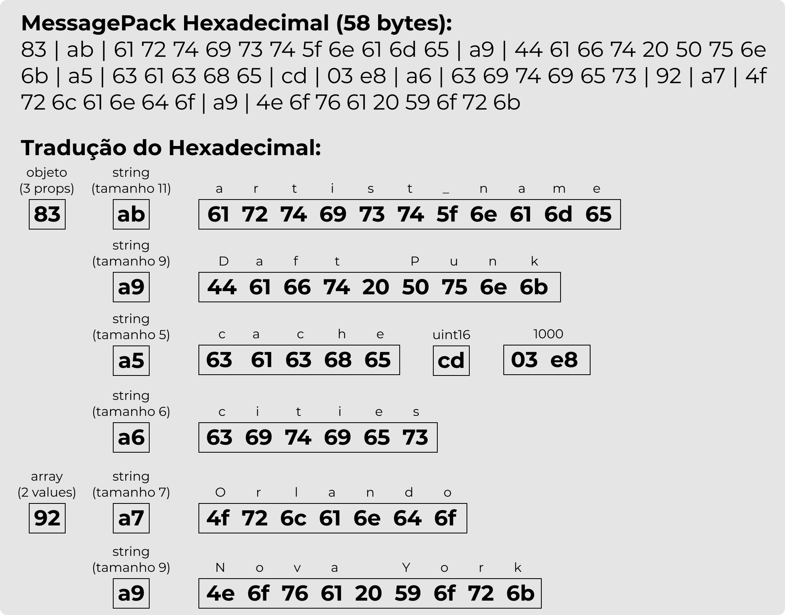
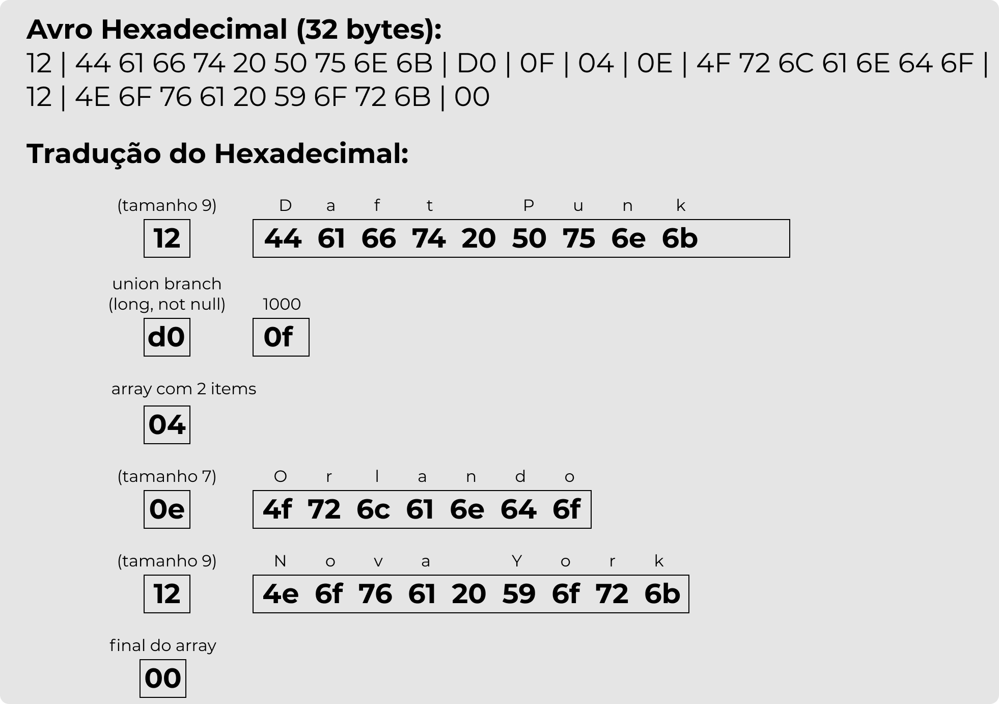

# Serialização de dados e seus formatos

## Introdução
Uma aplicação em execução mantém os dados em memória em formato de objetos, listas, *arrays*, *hash tables*, árvores, etc.
Essas estruturas são utilizadas pois permitem que a CPU às acessem de maneira eficiente.

### Como fazer quando queremos enviar esses dados em memória para outro local via rede?

Para trafegar esses dados via rede é necessário algum processo que agrupe as estruturas de dados em uma sequência de *bytes*.

*Afinal de contas, não faz sentido enviar um ponteiro de memória para outra máquina* 😅

1. Esse processo de transformar as estruturas de dados em bytes é conhecido como ”serialização” (também pode ser chamado de encoding ou marshalling).
  

2. O processo inverso, de transformar bytes em estrutura de dados, é conhecido como ”desserialização” (também pode ser chamado de decoding ou unmarshalling).


>Para que você possa compreender mais facilmente os formatos de dados, 
é necessário saber dois conceitos: **O Sistema Hexadecimal** e a **Tabela ASCII**.

### O Sistema Hexadecimal

Trata-se de um sistema de numeração posicional que representa os números em base 16, sendo assim, utilizando 16 símbolos.
Este sistema utiliza os símbolos 0, 1, 2, 3, 4, 5, 6, 7, 8 e 9 do sistema decimal, além das letras A, B, C, D, E e F.

>Cada número hexa significa quatro bits de dados binários. **Um byte é criado por 8 bits e é representado por dois dígitos hexa**.
>
[Para saber mais...](https://canaltech.com.br/produtos/O-que-e-sistema-hexadecimal/)

### A Tabela ASCII

> Código Padrão Americano para o Intercâmbio de Informação (do inglês *American Standard Code for Information Interchange* - ASCII)
é um sistema de representação de letras, algarismos e sinais de pontuação e de controle, através de um sinal codificado em forma de código binário
(cadeias de bits formada por vários 0 e 1).

Em poucas palavras, essa tabela é usada para representar textos em computadores, equipamentos de comunicação, entre outros dispositivos que trabalham com texto.

Com a tabela é possível identificar que a letra `A` é equivalente ao *byte* `0100 0001`. Como já aprendemos o **Sistema Hexadecimal**, 
toda vez que falarmos em binário, vamos utilizar sua representação em Hexadecimal para ficar mais enxuto (apenas dois caracteres).
A letra `A` então fica `0x41` em Hexadecimal (mais legível que `0100 0001`).

Para facilitar mais ainda a leitura, vamos cortar o começo `0x` e só nos preocupar com os dois últimos dígitos: `41`.
Logo, podemos dizer que `A` é `41` em Hexadecimal.

Para reforçar o exercício, vá ate a tabela ASCII e tente encontrar a representação da letra `M`
em Hexadecimal.

Se você encontrou `4d` ou `4D`, parabéns, você acertou!

[Para saber mais...](https://pt.wikipedia.org/wiki/ASCII)

## Serializando os dados

Já aprendemos sobre os processos de `serialização` e `desserialização`. 
Agora precisamos saber qual formato escolher na hora de converter as estruturas de dados para binário.

Dentre os principais formatos, destaco dois: **Formatos Textuais** e **Formatos Binários**.


Para entender a diferença de um formato para o outro, vamos considerar a seguinte instância da classe *Artist*:
```java
final Artist artist = 
    new Artist("Daft Punk", 1000, List.of("Orlando", "Nova York"));
```

> A classe *Artist* possui três propriedades:
>- `artistName` que é uma String;
>- `cache` que é um Integer;
>- `cities` que é uma Lista de String.

### Os Formatos Textuais

Para entender os formatos textuais, vamos analisar o resultado da serialização do objeto `artist` criado na sessão anterior.

Serializando em **JSON**, obtemos o seguinte resultado:
```json
{
  "artist_name": "Daft Punk",
  "cache": 1000,
  "cities": [ "Orlando", "Nova York" ]
}
```

Como já sabemos que cada carácter pesa 1 *byte* e esse texto tem 71 caracteres ao todo, 
seu resultado final é de 73 *bytes* pois conta dois *bytes* adicionais são da notação JSON.

O mesmo objeto, mas agora em **XML**, obtemos o seguinte resultado:
```xml
<?xml version="1.0" encoding="UTF-8"?>
<root>
  <artistName>Daft Punk</artistName>
  <cache>1000</cache>
  <cities>
    <element>Orlando</element>
    <element>Nova York</element>
  </cities>
</root>
```

Reparem que a especificação do `XML` trabalha com tags (`<element></element>`), essa característica faz
com que o resultado tenha uma quantia bem maior de caractéres e reflete diretamente no tamanho 
do resultado final que ficou em 173 *bytes*.


>- O XML contém os demarcadores `<`, `/` e `>`repetidas vezes para cada propriedade, além de tags de abertura e encerramento de propriedade.
Essas características fazem com que seu tamanho seja superior ao do JSON.
> 
> 
>- O JSON por sua vez, demarcadores como `"` e `:`, mas repare que já em uma quantidade bem inferior a do XML.
Por isso seu tamanho é 60% menor que o XML.

### Os Formatos Binários

Para entender os formatos binários, também vamos analisar o resultado da serialização do objeto `artist` no começo da sessão "Serializando os dados".

#### Formato MessagePack

Serializando o objeto `artist` utilizando o formato **MessagePack**, 
vemos uma redução significante no tamanho do resultado final,
que não tem uma representação textual legível.

Para ilustrar melhor, coloquei abaixo o binário do **MessagePack** em formato hexadecimal:
```
83 | ab | 61 72 74 69 73 74 5f 6e 61 6d 65 | a9 | 44 61 66 74 20 50 75 6e 6b |
   | a5 | 63 61 63 68 65 | cd | 03 e8 |
   | a6 | 63 69 74 69 65 73
92 | a7 | 4f 72 6c 61 6e 64 6f
   | a9 | 4e 6f 76 61 20 59 6f 72 6b
```

O resultado final cai de 73 *bytes* (em JSON) para 58 *bytes* em formato **MessagePack**, **uma redução de ~25,5%**.
Isso se dá por conta de que é um formato um pouco mais enxuto, não conta com nenhum demarcador como `:` e `"`.

Traduzindo esse binário utilizando a tabela ASCII, fica mais fácil de entender o que está contido na mensagem:



#### Formato Avro

Serializando o objeto `artist` utilizando o formato **Avro**,
vemos uma redução ainda mais significante no tamanho do resultado final,
que não conta nem com qual propriedade do objeto aquele valor pertence.
É literalmente uma concatenação de valores.

Para ilustrar melhor, coloquei abaixo o binário em formato hexadecimal:
```
12 | 44 61 66 74 20 50 75 6E 6B |
D0 | 0F |
04 |
0E | 4F 72 6C 61 6E 64 6F
12 | 4E 6F 76 61 20 59 6F 72 6B
00
```
O resultado cai de 73 *bytes* (em JSON) para 32 *bytes* em formato **Avro**, **uma redução de ~56%**.

Traduzindo esse binário utilizando a tabela ASCII, fica mais fácil de entender o que está contido na mensagem:



## Referências

[Especificação do JSON](https://www.json.org/json-pt.html)

[Site do MessagePack](https://msgpack.org/)

[Especificação do MessagePack](https://github.com/msgpack/msgpack/blob/master/spec.md)

[Convertendo Object para binário com MessagePack](https://github.com/msgpack/msgpack-java/blob/develop/msgpack-jackson/README.md)

[Site do Avro](https://avro.apache.org/)
